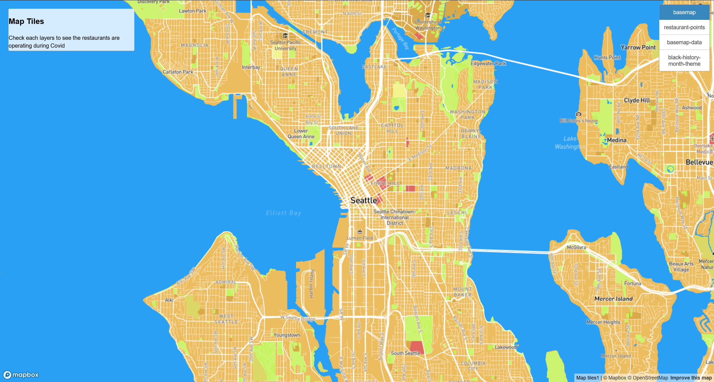
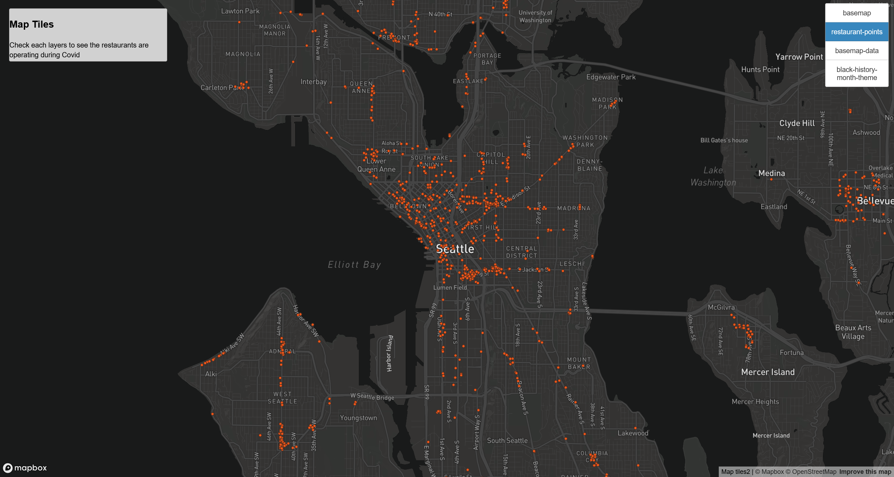
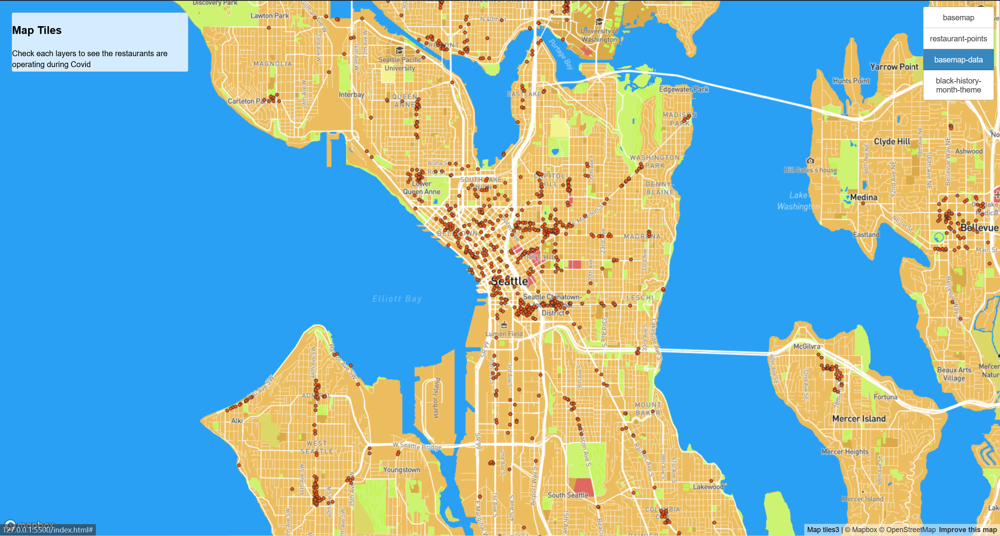
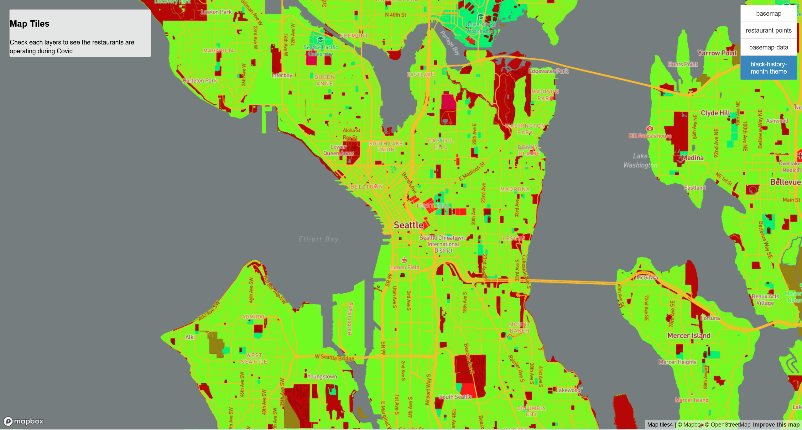

# Map Tiles Generation

Yuantai Li

GEOG458 Lab4

May 6, 2022

This project is creating a web map that shows the Seattle area with 4 tiles. The index.html visualized 4 tiles maps that users can click on each layer to see what's going on. I will introduce each layer below.

**The examined geographic area for this web map is located at Seattle(-122.332888, 47.606350)**

[The final map here](https://yuantai-li.github.io/geog458-lab4/)
## Tile 1: The basemap

This is the basemap of Seattle area in center of -122.332888, 47.606350. And the available max zoom level is 18.  This map is created by [Mapbox](https://studio.mapbox.com/) using basic map with diiferent colors as a basemap.

## Tile 2: The Thematic Map

This is the basemap shows the locations of Seattle area restaurants were operating during the covid. And the available max zoom level is 18. The data is from [Seattle open data](https://data.seattle.gov/dataset/Restaurants-Operating-during-COVID19/im7u-fmi8) downloaded as geojson format.

## Tile 3: The basemap and data

This map combins the first tile and the second tile together to show the distribution of Seattle area restaurants were operating during the covid. And the available max zoom level is 18.

## Tile 4: Black history months theme map

This map is created by mapbox that shows a theme of Black history months. The colors used mainly are yellow, red, and green. And the available max zoom level is 18.

